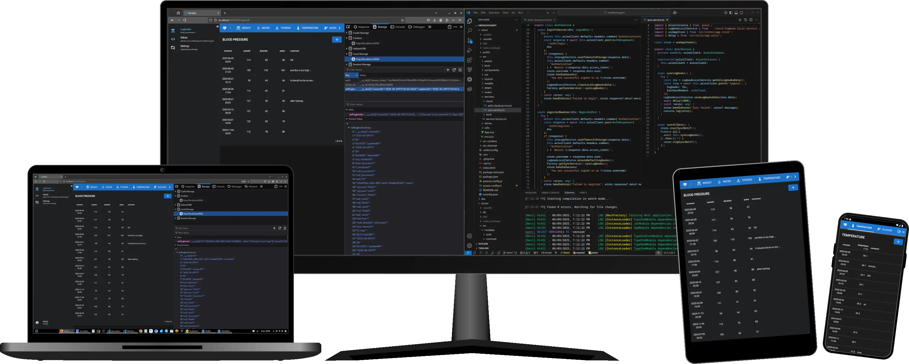
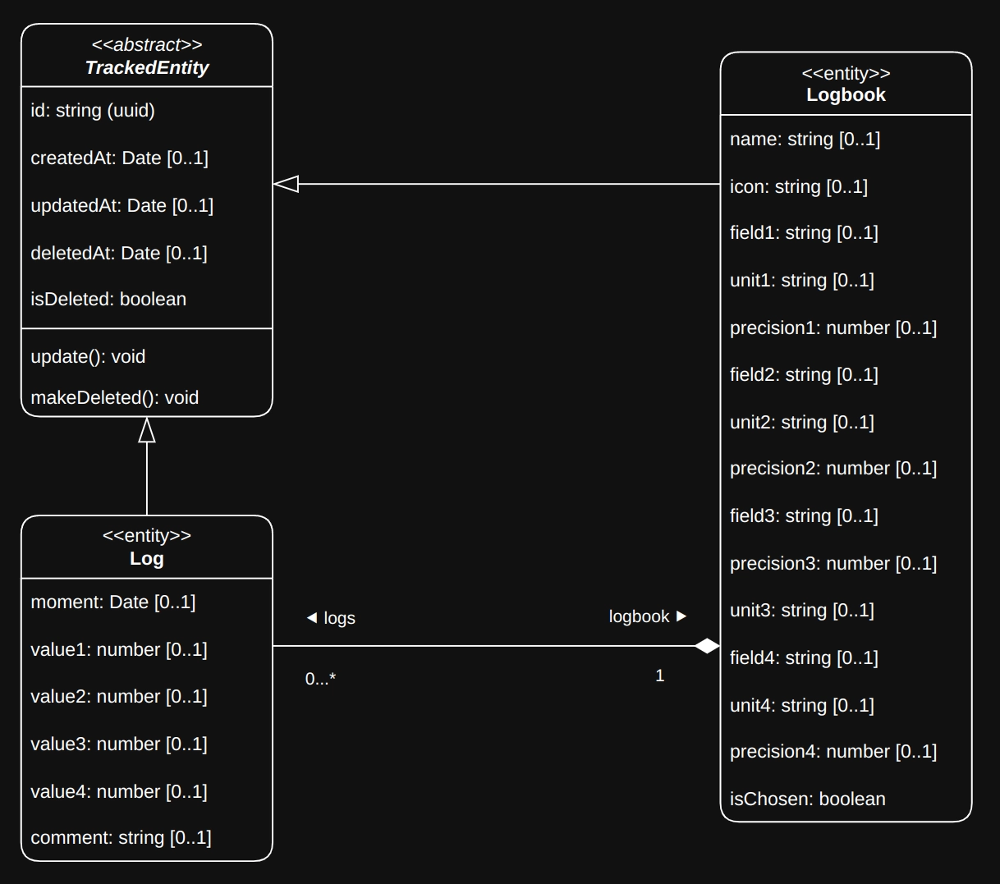
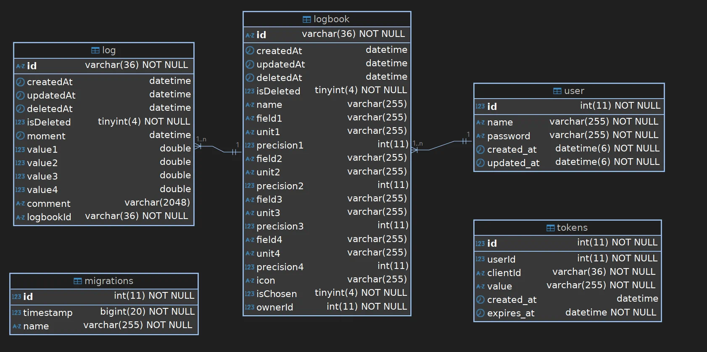
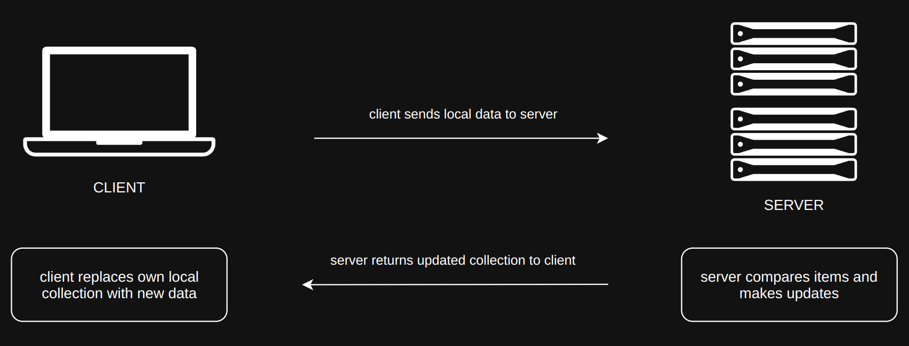

# Mediko
### Store own health data and synchronize across devices.

### HoGent graduation thesis
## Cross-platform application with Vue, Quasar and NestJs

This thesis aims to answer the question of whether a software development method based on using single source code in JavaScript/TypeScript and publication across multiple platforms can produce a reliable working application. This method could be very useful for developers whose code can also be published as standalone applications. The technologies used will include: Quasar, Vue, NestJS, Electron and Cordova.



## Language
Both, frontend and backend use [TypeScript](https://www.typescriptlang.org/) programming language.

## Domain
Client domain model is described by the diagram below:


## Client application
Client is a [Vue.Js](https://vuejs.org/) based [Quasar](https://quasar.dev) application. We save data in local storage.
The application can be build for desktop (Windws, Linux & macOS) with [Electron](https://www.electronjs.org/) and for mobile (Android & iOS) with [Cordova](https://cordova.apache.org/)

### Installation
First, Install the Quasar global CLI:
```shell
npm i -g @quasar/cli
``` 

Next, open your terminal in the 'client' folder and install node packages.
```shell
npm i
```

To start client web application use the following command:
```shell
quasar dev
```

### Build Electron Desktop App
First, prepare you system following [Quasar documentation](https://quasar.dev/quasar-cli-vite/developing-electron-apps/introduction)

You can start the Electron Application with
```shell
quasar dev -m electron
```

On Linux GNOME, if you have an error [Gtk-ERROR **](https://www.electronjs.org/blog/electron-36-0#behavior-changed-gtk-4-is-the-default-when-running-on-gnome) use the following command:

```shell
quasar dev -m electron -- --gtk-version=3
```
or run :
```shell
npm run electron-linux
```


### Build Mobile App
Please, make sure your platform is correctly configured for Cordova Development following [Quasar Preparation for Cordova App Docs](https://quasar.dev/quasar-cli-vite/developing-cordova-apps/preparation). Make sure the Cordova CLI, Android Studio and the required SDKs are installed.

```shell
npm install -g cordova
```

start the app in development mode:
```shell
quasar dev -m cordova -T [android|ios]
```


## Synchronization
Synchronization is achieved by using the [Nest.JS](https://nestjs.com/) server and [MySQL](https://www.mysql.com/) database on the backend side.

Database Entity Relationship diagram:



Diagram illustrating the data synchronization strategy:


### Server Installation
First, create new database and user in MySQL (or MariaDB).
```sql
CREATE DATABASE medikoproof;
CREATE USER medikohogent@localhost IDENTIFIED BY '*PASSWORD*';
GRANT ALL PRIVILEGES ON medikoproof.* TO 'medikohogent'@'localhost';
FLUSH PRIVILEGES;
```

Next, open your terminal In the 'server' folder and install the nest.js global CLI:
```shell
npm i -g @nestjs/cli
```
Install node modules:
```shell
npm i
```

Run migration scripts:
```shell
npm run migration:run
```

Start the server:
```shell
npm run dev
```


